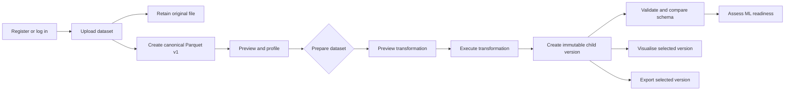
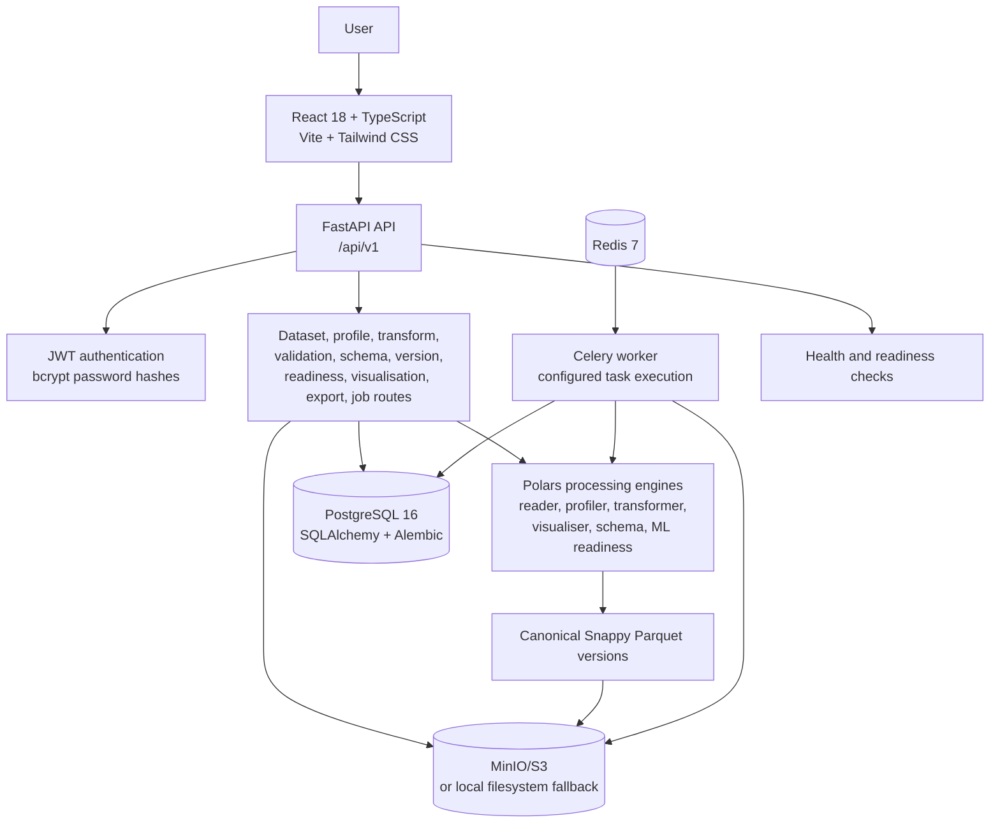

# DataForge

### Intelligent Data Preparation & ML Readiness Platform

[](backend/requirements.txt)
[](backend/requirements.txt)
[](frontend/package.json)
[](frontend/package.json)
[](frontend/package.json)
[](docker-compose.yml)
[](backend/requirements.txt)

DataForge is an authenticated workspace for inspecting, cleaning, transforming, validating, versioning, visualising, and assessing datasets before they enter a machine-learning workflow.

**Repository:** [SathvikHegade/DataForge](https://github.com/SathvikHegade/DataForge.git)  
**API documentation:** run the backend locally and open [`/docs`](http://localhost:8000/docs) or [`/redoc`](http://localhost:8000/redoc)  
**Configured frontend deployment:** [dataforge-orcin.vercel.app](https://dataforge-orcin.vercel.app)  
**Configured API origin:** [dataforge-a1fh.onrender.com](https://dataforge-a1fh.onrender.com)

> Deployment URLs are taken from the repository configuration. Availability depends on the corresponding hosted services.

## Why DataForge

Raw datasets rarely arrive ready for modelling. They can contain missing values, duplicate records, inconsistent types, outliers, unexpected schema changes, and columns with little or no useful variation. Finding those issues manually makes preparation slow and makes it difficult to reproduce what changed.

DataForge keeps that preparation in one version-aware workflow. Users can upload a dataset, inspect its structure and quality signals, preview and apply transformations, compare the result with an expected schema, validate it, review ML-readiness findings, and export a selected version.

## What Is Implemented

| Capability | Current implementation |
| --- | --- |
| Authentication | Registration, login, current-user lookup, logout response, bcrypt password hashing, and HS256 bearer tokens. |
| Dataset ingestion | Authenticated upload of CSV, TXT-as-CSV, Parquet, JSON/NDJSON, XLSX, and XLS files. Empty datasets are rejected. |
| Canonical storage | The original upload is retained separately and each dataset version is stored as Snappy-compressed Parquet with checksum and schema metadata. |
| Preview | Paginated previews of a selected version, with row and column metadata. Page size is limited to 1-500 rows. |
| Profiling | Numerical, categorical, date, missing-value, duplicate, constant-column, mixed-type, outlier, histogram, and overall health-score analysis. |
| Transformations | Preview and execution of 25 supported operations across missing values, duplicates, types, columns, strings, dates, numerical scaling, categorical encoding, outliers, rows, and ML splits. |
| Validation | Checks for non-empty data, duplicate records, null integrity, numerical finiteness, column names, and constant columns; results are persisted with severity levels. |
| Schema compatibility | Save reusable schema definitions and compare a dataset version with a saved or custom expected schema. |
| Versioning and lineage | Immutable Parquet versions, parent-version references, transformation history, branches, version comparison, and restore by changing the active version. |
| ML readiness | Rule-based readiness scoring, findings, recommendations, unresolved issues, task type, and optional target-column analysis. This is not model training. |
| Visualisation | Authenticated, version-aware histogram, KDE, box, violin, categorical, scatter, correlation, pair-plot, line, grouped-box, and missing-value chart data. |
| Export | CSV, Parquet, JSON, and XLSX export endpoints are defined for a selected dataset version. See the limitations section for the current JSON defect. |
| Background jobs | Redis/Celery configuration, a worker service, task implementations, job records, polling, and cancellation endpoints are present. Current profiling and transformation API routes execute synchronously. |

## Workflow



## System Architecture



In the Docker Compose topology, PostgreSQL stores application metadata, Redis provides the Celery broker/backend, and MinIO provides S3-compatible object storage. Outside Compose, the application defaults to SQLite and local filesystem storage. The API currently performs profiling and transformation requests synchronously; the Celery worker and task modules are available for background execution, but the current routes do not dispatch those operations through Celery.

## Transformation Catalog

The API exposes the catalog at `GET /api/v1/transformations/operations`.

| Category | Operations |
| --- | --- |
| Missing values | Drop rows; fill with constant, mean, median, or mode |
| Duplicates | Remove duplicate rows |
| Type and column operations | Cast type; rename, drop, select, or duplicate columns |
| Strings and dates | Trim, change case, replace patterns, normalize strings, parse dates, extract date components |
| Numerical | Standard scale, min-max scale, logarithmic transform |
| Categorical | One-hot encoding and ordinal encoding |
| Outliers and rows | IQR/z-score clip or remove; filter and sort rows |
| ML preparation | Train/test/validation split with a split-assignment column |

Every successful transformation creates a new version rather than mutating the source version.

## API Surface

All application endpoints use the `/api/v1` prefix and require a bearer token unless noted otherwise.

| Area | Routes |
| --- | --- |
| Health | `GET /health`, `GET /health/ready` |
| Authentication | `POST /auth/register`, `POST /auth/login`, `GET /auth/me`, `POST /auth/logout` |
| Datasets | `POST /datasets/upload`, `GET /datasets/`, `GET /datasets/{id}`, `DELETE /datasets/{id}`, `GET /datasets/{id}/preview` |
| Profiling | `GET|POST /datasets/{id}/profile` |
| Transformations | `GET /transformations/operations`, `POST /transformations/preview`, `POST /transformations/execute`, `GET /transformations/history/{id}` |
| Validation | `POST /validation/{id}/validate`, `GET /validation/{id}/report` |
| Schemas | `POST|GET /schemas/`, `GET|DELETE /schemas/{schema_id}`, `POST /schemas/compare` |
| Versions | `GET /datasets/{id}/versions`, `GET /datasets/{id}/versions/{version_id}`, `POST .../compare`, `POST .../restore`, `POST .../branch` |
| ML readiness | `GET|POST /datasets/{id}/readiness` |
| Visualisation | `GET .../visualizations/metadata`, `POST .../visualizations/chart` |
| Export | `POST /datasets/{id}/export` |
| Jobs | `GET /jobs/`, `GET /jobs/{job_id}`, `POST /jobs/{job_id}/cancel` |

FastAPI generates the complete interactive contract at `/docs` and `/redoc` when the backend is running.

## Frontend Workspace

The React client includes routes for:

- Landing, registration, and login
- Dashboard and dataset library
- Dataset upload, overview, and paginated preview
- Profiling and quality analysis
- Transformation builder and validation report
- ML readiness and schema compatibility
- Version history and lineage comparison
- Data visualisation and background-job monitoring

The client uses React Router, TanStack Query, Recharts, Lucide icons, and Tailwind CSS. The API base URL is read from `VITE_API_BASE_URL`; when it is not set, the client uses the configured Render API origin.

## Quick Start

### Docker Compose

The complete local stack is the recommended way to run the project:

```bash
cp .env.example .env
docker compose up --build
```

Open:

| Service | URL |
| --- | --- |
| Frontend | <http://localhost:3000> |
| Backend | <http://localhost:8000> |
| Swagger UI | <http://localhost:8000/docs> |
| ReDoc | <http://localhost:8000/redoc> |
| MinIO API | <http://localhost:9000> |
| MinIO console | <http://localhost:9001> |

Compose also exposes PostgreSQL on `localhost:5432` and Redis on `localhost:6379`.

### Backend only

For a standalone local backend, SQLite and local filesystem storage are supported by default:

```powershell
cd backend
python -m venv .venv
.venv\Scripts\Activate.ps1
pip install -r requirements.txt
uvicorn app.main:app --reload --port 8000
```

Set `DATABASE_URL` and `STORAGE_BACKEND` in `.env` when using PostgreSQL or S3/MinIO. The application creates missing SQLAlchemy tables at startup; Alembic migration configuration is also included.

### Frontend only

```bash
cd frontend
npm install
npm run dev
```

Create a production bundle with:

```bash
npm run build
```

## Configuration

Copy `.env.example` to `.env` and review the values before running the stack. The main settings are:

| Group | Variables |
| --- | --- |
| Application | `PROJECT_NAME`, `API_V1_STR`, `ENVIRONMENT` |
| Security | `SECRET_KEY`, `ALGORITHM`, `ACCESS_TOKEN_EXPIRE_MINUTES` |
| Database | `DATABASE_URL`, `POSTGRES_USER`, `POSTGRES_PASSWORD`, `POSTGRES_DB` |
| Jobs | `REDIS_URL` |
| Object storage | `STORAGE_BACKEND`, `S3_ENDPOINT_URL`, `S3_ACCESS_KEY`, `S3_SECRET_KEY`, `S3_BUCKET_NAME`, `S3_SECURE`, `LOCAL_STORAGE_DIR` |
| CORS and frontend | `CORS_ORIGINS`, `VITE_API_BASE_URL` |
| Processing | `MAX_UPLOAD_SIZE_MB`, `MAX_PREVIEW_ROWS`, `CHUNK_SIZE_ROWS` |

The configured upload limit is 500 MB, but uploads and Parquet reads are currently buffered in memory. Set a unique secret key of at least 32 characters for production and never commit credentials from `.env`.

## Testing

Backend tests:

```bash
cd backend
python -m pytest -q
```

Frontend tests and production build:

```bash
cd frontend
npm test -- --run
npm run build
```

The repository’s recorded verification reports 22 passing backend tests, 4 passing frontend tests, and a successful frontend production build. Coverage is focused: browser end-to-end workflows and live PostgreSQL, Redis/Celery, and MinIO integrations are not covered by the current test suite.

## Known Limitations

This project is a strong working prototype, but it should not be presented as production-ready for unfamiliar datasets without further fixes and integration testing.

- JSON export currently fails because the exporter passes an unsupported `pretty` argument to Polars.
- Filling a Boolean column with an invalid constant can silently coerce the column to text.
- One-hot encoding missing categories can produce null indicator values instead of binary zeros.
- Current profiling and transformation routes are synchronous even though Celery worker infrastructure and task implementations exist.
- Uploads are fully buffered in memory; no large-file or concurrency guarantee has been established.
- There are no browser end-to-end tests for the complete upload-to-export workflow.
- The current suite does not prove production storage, worker, authorization, concurrency, or hosted deployment behavior.

See [DATAFORGE_RED_TEAM_REPORT.md](DATAFORGE_RED_TEAM_REPORT.md) for the detailed findings and recommended regression coverage.

## Project Documentation

- [Data visualisation API and behavior](docs/DATA_VISUALISATION.md)
- [Architecture visualization](docs/architecture.html)
- [Architecture data](docs/dataforge.architecture.json)
- [Security and readiness report](DATAFORGE_RED_TEAM_REPORT.md)

## Repository Layout

```text
backend/
  app/
    api/          FastAPI dependencies and route modules
    core/         Security, storage, and Celery configuration
    engine/       Reading, profiling, transformation, schema, ML, and export logic
    models/       SQLAlchemy persistence models
    schemas/      Pydantic request and response schemas
    workers/      Background task implementations
  alembic/        Database migration configuration and revisions
  tests/          Backend unit and route tests
frontend/
  src/
    api/          Typed API client
    components/   Shared application layout and controls
    context/      Authentication and dataset state
    pages/        Workspace views
docs/             Architecture and visualisation documentation
sample_data/      Example dirty customer-churn CSV
docker-compose.yml
```

## License

No license file is currently included in the repository.